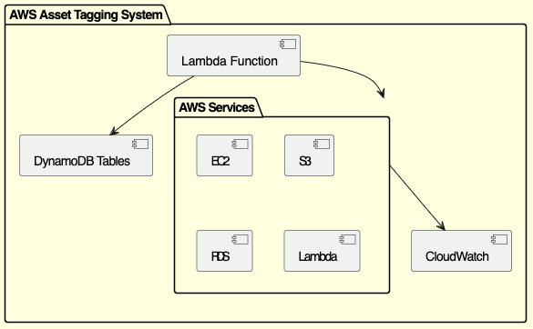

# AWS Asset Tagging Script for SOC-2 Compliance

## Introduction
This script is designed to automatically tag AWS resources across all Data Centers in a specified AWS Account to meet SOC-2 compliance requirements. The script is written in Python 3.12 and is intended to be deployed as an AWS Lambda function.

## Features
- **Automatic Tagging:** Tags all AWS assets with predefined tags.
- **Metadata Storage:** Stores tagging metadata in DynamoDB for auditing and reporting.
- **Error Handling:** Robust error handling with alerts sent to AWS CloudWatch.
- **Configuration Management:** Flexible configuration using environment variables.

## Components Diagram

## Prerequisites
- Python 3.12
- AWS account with necessary permissions
- Boto3 installed
- AWS CLI configured
- DynamoDB tables for metadata storage

## Installation
1. Clone this repository.
2. Install dependencies using `pip install -r requirements.txt`.
3. Configure environment variables for AWS Account ID, DynamoDB table names, etc.
4. Deploy the script as an AWS Lambda function using the AWS CLI or Terraform.

## Usage
The script can be triggered manually or set to run on a schedule using CloudWatch Events. It will automatically tag all AWS resources and store metadata in DynamoDB.

## Testing
Unit tests are provided to validate the functionality of each module. Run the tests using `pytest`.

## Contribution
Feel free to contribute to this project by opening issues or submitting pull requests.

## License
This project is licensed under the MIT License.
